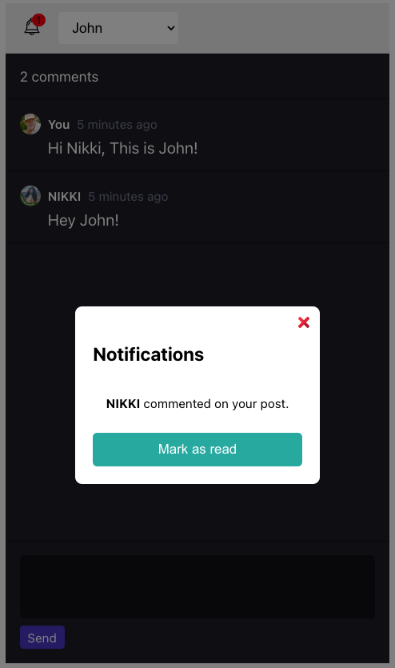

# TweetStream App []() [](https://github.com/nikitabijwe/tweetstream/issues)

## TweetStream App

- [FrontEnd](https://github.com/nikitabijwe/tweetstream/tree/main/frontend) – React
- [Backend](https://github.com/nikitabijwe/tweetstream/tree/main/backend) – Node.js


## UserGuide

### Steps to run FrontEnd App 

```sh
cd frontend
npm install
npm start
```

Then open [http://localhost:3000/](http://localhost:3000/) to see your app.<br>

### Steps to run Backend App 

```sh
cd backend
npm run dev
```

Then open [http://localhost:4000/](http://localhost:4000/) to see your app.<br>



